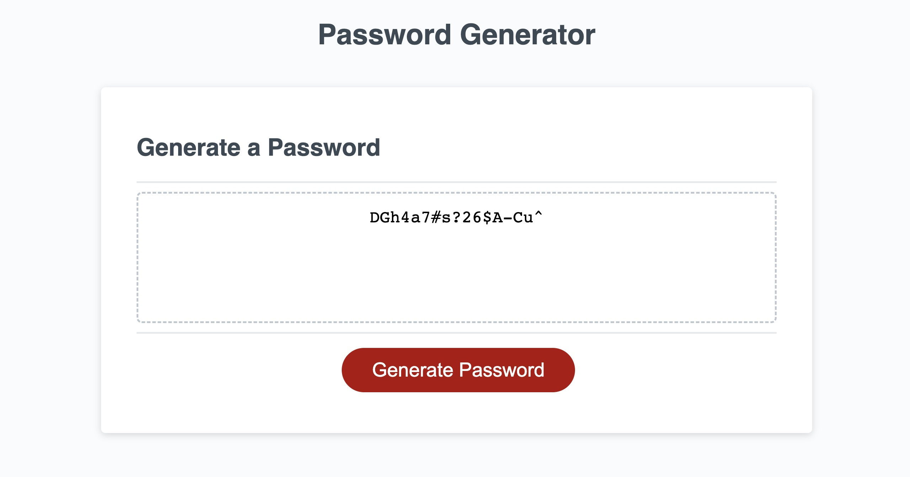

# Toliver's Password Generator

## Description

My password generator uses Javascript and window prompts to accept user choices about which characters they would like to include in their randomly generated password, and produces a password accordingly. If you need a secure, reliable password (and if you really like living on the edge), feel free to create one here!
  
## Table of Contents
  - [Installation](#installation)
  - [Usage](#usage)
  - [Contribution](#contribution)
  - [Tests](#tests)
  - [Questions](#questions)

## Installation

No installation neccesary. Clone the repo to your local machine, open the code in your text editor of choice, and open the index.html in your browser.

## Usage

Simply click the "Generate Password" button and, when prompted, choose which character types you would like to include in your generated password.

### Screenshots

## License

This project has been released under the MIT license.

---

## Questions

  - Github [@tolivercrisp](https://github.com/tolivercrisp)
  - Email: [toliverjcrisp@gmail.com]

